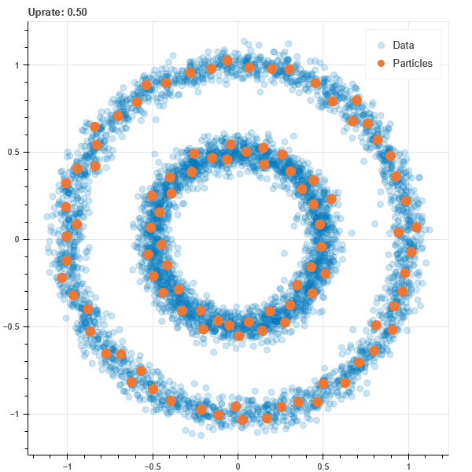

# NeuGas

​       

This is a very basic implementation of **Neural Gas**, an Artificial Neural Network widely used for *vector quantization* and *cluster analysis*.

NG was created at the beginning of 90's by Thomas Martinetz and Klaus Schulten. You can find a description of this approach [here](http://www.ks.uiuc.edu/Publications/Papers/PDF/MART91B/MART91B.pdf).

---
